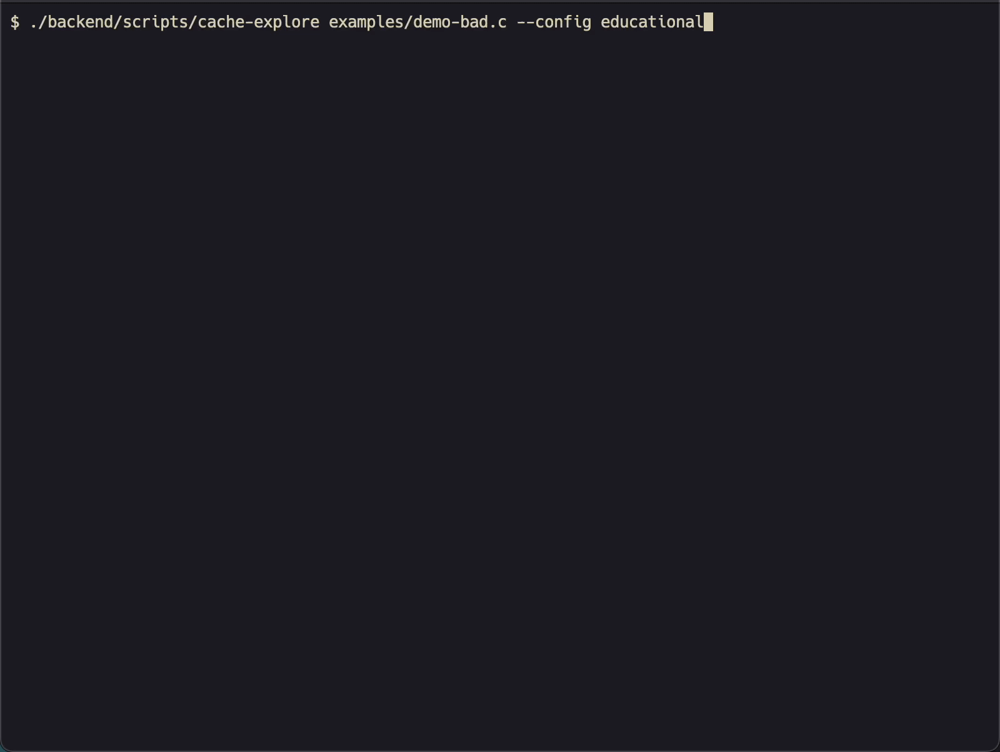
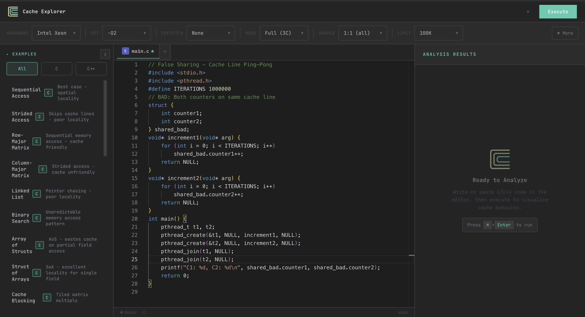
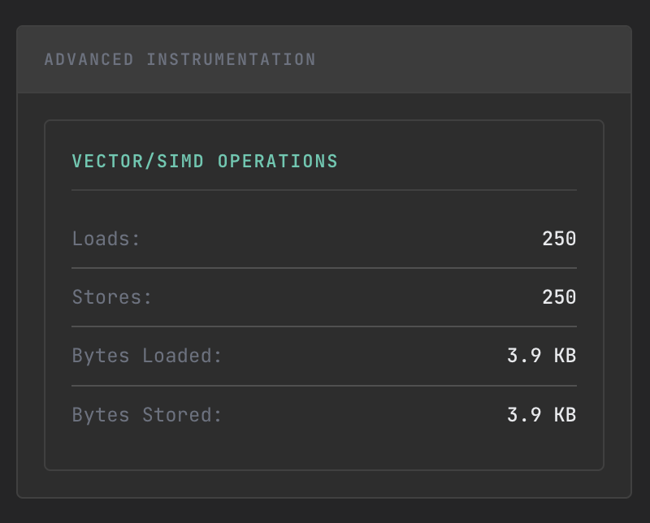
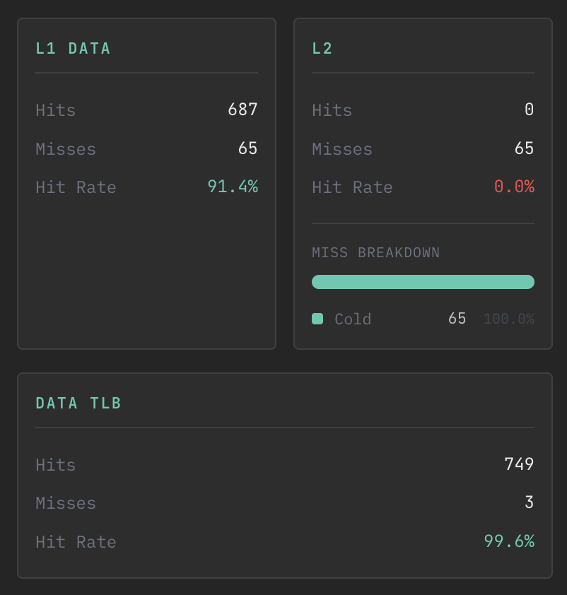
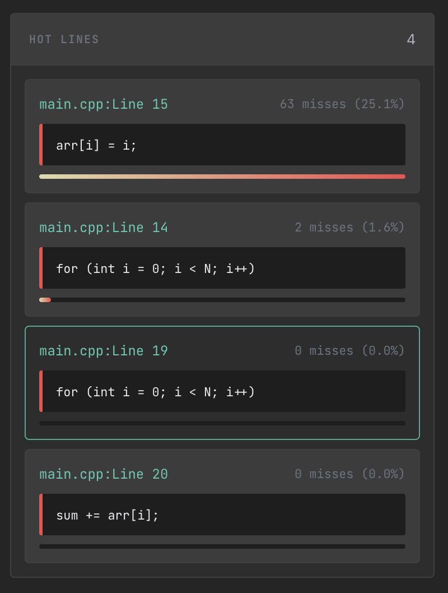

# Cache Explorer

<p align="center">
        
</p>

> Visualize CPU cache behavior in real-time. See exactly which lines of your code cause cache misses.

[](LICENSE)

## Why Cache Explorer?

**Before Cache Explorer:**
"Why is my code slow?" → Guesswork, profilers, prayer

**After Cache Explorer:**

```
$ cache-explore matrix.c --config intel

L1 Hit Rate: 94.2%  |  L2: 78.1%  |  L3: 99.8%

Hot Lines:
  matrix.c:42    1,245 misses (column-major access pattern)
  matrix.c:38      892 misses (strided access)

Suggestions:
  - Swap loop order at line 42 for ~10x fewer L1 misses
  - Consider blocking for better L2 utilization
```

<p align="center">  </p>

<p align="center">   </p> <p align="center">   </p>
<!-- [Screenshot of web UI here] -->

## Quick Start

### Docker (Easiest)

```bash
docker pull ghcr.io/yourusername/cache-explorer:latest
docker run -p 3001:3001 cache-explorer
# Open http://localhost:3001
```

### CLI Tool

```bash
# macOS
brew install llvm cmake ninja

# Clone and build
git clone https://github.com/yourusername/cache-explorer.git
cd cache-explorer
./scripts/build.sh

# Analyze your code
./backend/scripts/cache-explore mycode.c --config intel --json
```

## Features

- **Source-level attribution** - See exactly which line caused each cache miss
- **3C miss classification** - Compulsory, Capacity, Conflict breakdown
- **MESI coherence** - Full multi-core cache coherence simulation
- **False sharing detection** - Find hidden performance killers in threaded code
- **6 prefetch policies** - None, Next-line, Stream, Stride, Adaptive, Intel DCU
- **14 hardware presets** - Intel, AMD, Apple Silicon, ARM, Educational
- **Real-time visualization** - WebSocket streaming to interactive UI
- **Works offline** - No cloud, no rate limits, your code stays local

## Hardware Presets

| Vendor       | Presets                                        |
| ------------ | ---------------------------------------------- |
| **Intel**    | 12th Gen, 14th Gen, Xeon, Sapphire Rapids      |
| **AMD**      | Zen 3, Zen 4, EPYC                             |
| **Apple**    | M1, M2, M3                                     |
| **ARM**      | AWS Graviton 3, Raspberry Pi 4                 |
| **Learning** | Educational (tiny caches to see misses easily) |

## How It Works

```
Source Code (.c/.cpp)
        │
        ▼
┌───────────────────────┐
│  LLVM Pass            │  Instruments every load/store
└───────────────────────┘
        │
        ▼
┌───────────────────────┐
│  Runtime Library      │  Captures: address, size, file:line
└───────────────────────┘
        │
        ▼
┌───────────────────────┐
│  Cache Simulator      │  MESI coherence, prefetching, TLB
└───────────────────────┘
        │
        ▼
┌───────────────────────┐
│  Web UI / JSON        │  Real-time visualization
└───────────────────────┘
```

## Installation

### Prerequisites

- **LLVM 17-21** (18 recommended)
- **CMake 3.20+**
- **Ninja** (optional but faster)
- **Node.js 18+** (for web UI)

### macOS

```bash
brew install llvm@18 cmake ninja node
export PATH="/opt/homebrew/opt/llvm@18/bin:$PATH"
```

### Ubuntu/Debian

```bash
wget https://apt.llvm.org/llvm.sh
chmod +x llvm.sh
sudo ./llvm.sh 18
sudo apt install cmake ninja-build nodejs npm
```

### Build

```bash
git clone https://github.com/yourusername/cache-explorer.git
cd cache-explorer

# Build everything
cd backend/cache-simulator && mkdir -p build && cd build
cmake .. -G Ninja && ninja && cd ../../..

cd backend/llvm-pass && mkdir -p build && cd build
cmake .. -G Ninja -DLLVM_DIR=$(llvm-config --cmakedir) && ninja && cd ../../..

cd backend/runtime && mkdir -p build && cd build
cmake .. -G Ninja && ninja && cd ../../..

# Start the server
cd backend/server && npm install && node server.js &

# Start the frontend
cd frontend && npm install && npm run dev
```

## CLI Usage

```bash
# Basic analysis
cache-explore mycode.c --config intel

# With prefetching simulation
cache-explore mycode.c --config amd --prefetch stream

# Fast mode (3x faster, skips 3C classification)
cache-explore mycode.c --fast

# JSON output for scripting
cache-explore mycode.c --json

# Custom optimization level
cache-explore mycode.c -O3 --config apple
```

## Running Tests

```bash
cd backend/cache-simulator/build
./CacheLevelTest        # 22 tests
./CacheSystemTest       # 25 tests
./MESICoherenceTest     # 19 tests
./MultiCorePrefetchTest # 18 tests
./MultiCoreTLBTest      # 8 tests
./AdvancedInstrumentationTest # 31 tests
# Total: 123 tests
```

## Limitations

- **Requires recompilation** - Can't trace pre-compiled binaries (use Intel Pin for that)
- **No speculative execution** - All accesses treated as committed
- **Single socket** - No NUMA simulation

## Contributing

See [CONTRIBUTING.md](CONTRIBUTING.md) for guidelines.

## License

MIT - See [LICENSE](LICENSE) for details.

## Acknowledgments

Inspired by [Compiler Explorer](https://godbolt.org) and [Cachegrind](https://valgrind.org/docs/manual/cg-manual.html).
