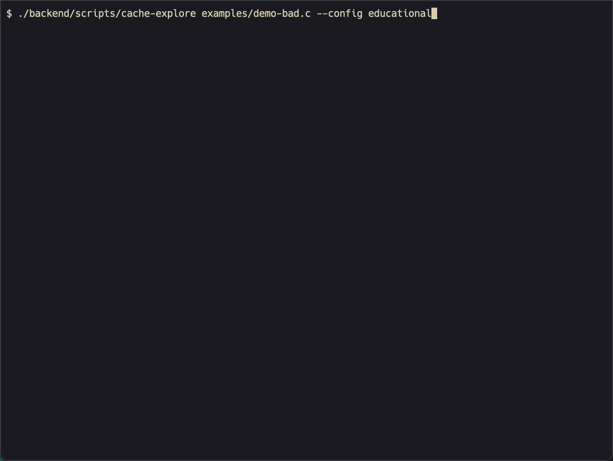

# Cache Explorer

[](https://github.com/AveryClapp/Cache-Explorer/actions/workflows/ci.yml)
[](https://github.com/AveryClapp/Cache-Explorer/releases)
[](https://github.com/AveryClapp/Cache-Explorer/stargazers)
[](LICENSE)

> Visualize CPU cache behavior in real-time. See exactly which lines of your code cause cache misses.

<p align="center">
  
</p>

## Why Cache Explorer?

**Before:** "Why is my code slow?" → Guesswork, profilers, prayer

**After:** Exact line-by-line cache miss attribution

<video src="https://github.com/user-attachments/assets/649aeef7-319c-4778-af70-9df88674da3b" controls width="600"></video>

## Quick Start

### Docker (Easiest)

```bash
git clone https://github.com/AveryClapp/cache-explorer.git
cd cache-explorer
docker-compose up --build
# Open http://localhost:8080
# Check health with: docker compose ps
# Product health is proxied at http://localhost:8080/health
```

### From Source

```bash
git clone https://github.com/AveryClapp/cache-explorer.git
cd cache-explorer

# Build if needed, install npm deps if needed, then run backend + frontend
./scripts/doctor.sh
./scripts/dev.sh
# Open the frontend URL it prints
```

### CLI Only

```bash
./backend/scripts/cache-explore mycode.c --config intel --json
```

Release builds publish pre-built `CacheProfiler` LLVM passes for supported LLVM
versions. The download helper uses the official release repo by default and
verifies binaries against the release `SHA256SUMS` manifest when it is present:

```bash
./backend/scripts/cache-explore-download-pass 21
CACHE_EXPLORER_REQUIRE_CHECKSUM=1 ./backend/scripts/cache-explore-download-pass 21
```

## Features

- **Source-level attribution** - See exactly which line caused each cache miss
- **3C miss classification** - Compulsory, Capacity, Conflict breakdown
- **MESI coherence** - Full multi-core cache coherence simulation
- **False sharing detection** - Find hidden performance killers in threaded code
- **6 prefetch policies** - None, Next-line, Stream, Stride, Adaptive, Intel DCU
- **14 hardware presets** - Intel, AMD, Apple Silicon, ARM, Educational
- **Hardware bottleneck summaries** - Estimated memory, branch, and front-end stalls
- **Real-time visualization** - WebSocket streaming to interactive UI
- **Works offline** - No cloud, no rate limits, your code stays local

## Hardware Presets

| Vendor       | Presets                                        |
| ------------ | ---------------------------------------------- |
| **Intel**    | 12th Gen, 14th Gen, Xeon, Sapphire Rapids      |
| **AMD**      | Zen 3, Zen 4, EPYC                             |
| **Apple**    | M1, M2, M3                                     |
| **ARM**      | AWS Graviton 3, Raspberry Pi 4                 |
| **Learning** | Educational (tiny caches to see misses easily) |

## How It Works

```
Source Code (.c/.cpp)
        │
        ▼
┌───────────────────────┐
│  LLVM Pass            │  Instruments every load/store
└───────────────────────┘
        │
        ▼
┌───────────────────────┐
│  Runtime Library      │  Captures: address, size, file:line
└───────────────────────┘
        │
        ▼
┌───────────────────────┐
│  Cache Simulator      │  MESI coherence, prefetching, TLB
└───────────────────────┘
        │
        ▼
┌───────────────────────┐
│  Web UI / JSON        │  Real-time visualization
└───────────────────────┘
```

## Installation

### Prerequisites

- **LLVM 17-21** (18 recommended)
- **CMake 3.20+**
- **Ninja** (optional but faster)
- **Node.js 18+** (for web UI)

### macOS

```bash
brew install llvm@18 cmake ninja node
export PATH="/opt/homebrew/opt/llvm@18/bin:$PATH"
```

### Ubuntu/Debian

```bash
wget https://apt.llvm.org/llvm.sh
chmod +x llvm.sh
sudo ./llvm.sh 18
sudo apt install cmake ninja-build nodejs npm
```

### Build

```bash
git clone https://github.com/AveryClapp/cache-explorer.git
cd cache-explorer

# Start the full local product
./scripts/doctor.sh
./scripts/dev.sh
```

## CLI Usage

```bash
# Basic analysis
cache-explore mycode.c --config intel

# With prefetching simulation
cache-explore mycode.c --config amd --prefetch stream

# Fast mode (3x faster, skips 3C classification)
cache-explore mycode.c --fast

# JSON output for scripting
cache-explore mycode.c --json

# Custom optimization level
cache-explore mycode.c -O3 --config apple

# List modeled hardware profile IDs
./backend/scripts/cache-explore profiles --ids

# Real-kernel hardware experiment
./backend/scripts/cache-explore examples/conv2d_kernel.c -O2 --hardware intel14 --json
./backend/scripts/cache-explore examples/conv2d_kernel.c -O2 -D RUN_TILED=1 --hardware intel14 --json
./backend/scripts/cache-explore compare examples/conv2d_kernel.c -O2 --configs educational,intel14,zen4,m3

# Compare named kernel variants across hardware profiles
./backend/scripts/cache-explore experiment examples/conv2d_kernel.c -O2 \
  --variant direct \
  --variant tiled:RUN_TILED=1 \
  --configs educational,intel14,zen4,m3 \
  --limit 200000
```

## Running Tests

```bash
cd backend/cache-simulator/build
./CacheLevelTest        # 22 tests
./CacheSystemTest       # 25 tests
./MESICoherenceTest     # 19 tests
./MultiCorePrefetchTest # 18 tests
./MultiCoreTLBTest      # 8 tests
./MultiCoreTraceProcessorTest # 2 tests
./AdvancedInstrumentationTest # 31 tests
```

Frontend build and browser smoke:

```bash
cd frontend
npm ci
npm run build
npm run bundle:check
npm run tokens:check
npm run diagnostics:check
npm run smoke:ui
npm run visual:check
```

Calibration evidence packets can be validated without running benchmarks:

```bash
./backend/scripts/cache-explore calibration
```

Workload verification can also write benchmark-history artifacts and render a
standalone HTML trend report:

```bash
./backend/scripts/cache-explore workloads --verify --json --history reports/workloads/history.json
./backend/scripts/cache-explore workloads --history-summary reports/workloads/history.json --html \
  > reports/workloads/history.html
```

On pushes to `main`, the `Workload Dashboard` workflow restores retained
workload-history JSON from the published Pages dashboard and the Actions cache,
keeps the latest 30 runs, and publishes an HTML trend report plus a
`workload-history-index.json` manifest to GitHub Pages when Pages is configured
for Actions.

The product workload catalog can surface that published history in-app. Point
the server at either a local summary file or the hosted dashboard:

```bash
CACHE_EXPLORER_WORKLOAD_HISTORY_SUMMARY_PATH=reports/workloads/workload-history-summary.json npm start
CACHE_EXPLORER_DASHBOARD_BASE_URL=https://owner.github.io/Cache-Explorer npm start
```

Tagged releases include pre-built LLVM pass assets, `SHA256SUMS` for download
verification, and GitHub artifact attestations for release provenance.
Published GHCR Docker images include BuildKit provenance attestations and SBOMs.
The `Release Validation` workflow runs when a GitHub Release is published, and
can also be run manually with a tag to verify pass checksums, pass attestations,
GHCR image availability, and attach the published workload-history archive to
the release after shipping.

For hosted/server operation, see
[Deployment Readiness](docs/DEPLOYMENT_READINESS.md). For the empirical ladder
behind hardware-profile trust labels, see
[Calibration Roadmap](docs/CALIBRATION_ROADMAP.md). Maintainers shipping builds
should use the [Release And Install Runbook](docs/RELEASE_INSTALL_RUNBOOK.md).

## Limitations

- **Requires recompilation** - Can't trace pre-compiled binaries (use Intel Pin for that)
- **No speculative execution** - All accesses treated as committed
- **Single socket** - No NUMA simulation

## Contributing

See [CONTRIBUTING.md](CONTRIBUTING.md) for guidelines.

Community and maintainer docs:

- [Quick Start](docs/QUICK_START.md)
- [User Guide](docs/USER_GUIDE.md)
- [How to Read Results](docs/HOW_TO_READ_RESULTS.md)
- [Validation](docs/VALIDATION.md)
- [Optimization Patterns](docs/OPTIMIZATION_PATTERNS.md)
- [CMake Integration](docs/CMAKE_INTEGRATION.md)
- [Support](SUPPORT.md)
- [Security Policy](SECURITY.md)
- [Governance](GOVERNANCE.md)
- [Code of Conduct](CODE_OF_CONDUCT.md)
- [Changelog](CHANGELOG.md)

## License

MIT - See [LICENSE](LICENSE) for details.

## Acknowledgments

Inspired by [Compiler Explorer](https://godbolt.org) and [Cachegrind](https://valgrind.org/docs/manual/cg-manual.html).
