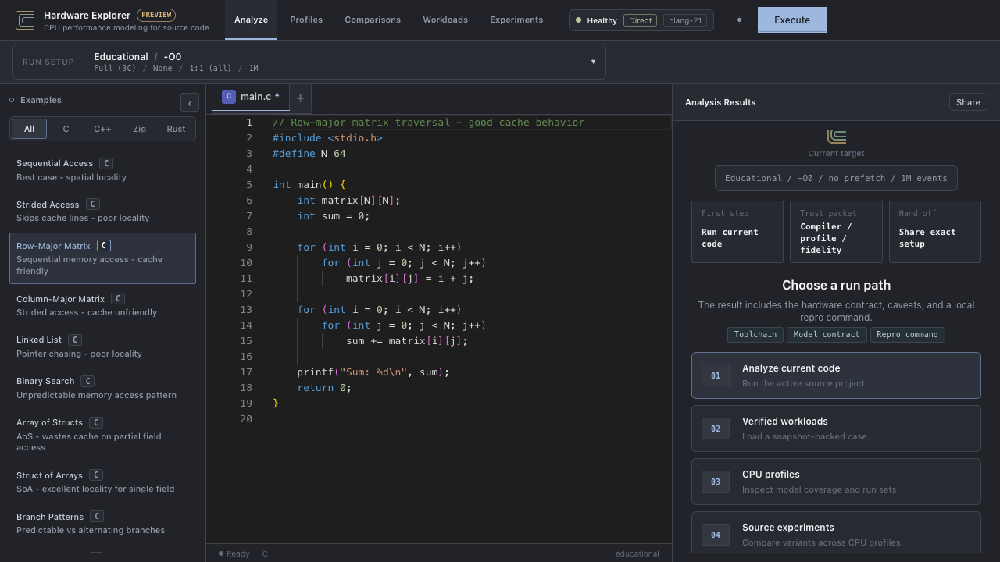

# Hardware Explorer Preview

[](https://github.com/AveryClapp/Cache-Explorer/actions/workflows/ci.yml)
[](https://github.com/AveryClapp/Cache-Explorer/releases)
[](https://github.com/AveryClapp/Cache-Explorer/stargazers)
[](LICENSE)

> CPU performance modeling for source code.

<p align="center">
  
</p>

Hardware Explorer is the Preview product name for Cache Explorer. It models CPU
cache, TLB, prefetch, coherence, branch, and pipeline behavior from instrumented
source. It is not a GPU, storage, or network explorer, and estimated cycles are
not cycle-accurate CPU simulation.

The product is local-first. Once dependencies and native artifacts are
installed, the UI and analysis path run without external web assets. A fresh
dependency install, first Docker image build, optional pass downloads, and
published workload history still require network access.

## Why Hardware Explorer?

**Before:** "Why is my code slow?" → Guesswork, profilers, prayer

**After:** Source-attributed CPU cache evidence and repeatable directional comparisons

<video src="https://github.com/user-attachments/assets/649aeef7-319c-4778-af70-9df88674da3b" controls width="600"></video>

## Quick Start

### Docker (Easiest)

```bash
git clone https://github.com/AveryClapp/cache-explorer.git
cd cache-explorer
docker compose up --build
# Open http://localhost:8080
# Check health with: docker compose ps
# Product health is proxied at http://localhost:8080/health
```

### From Source

```bash
git clone https://github.com/AveryClapp/cache-explorer.git
cd cache-explorer

# Build if needed, install npm deps if needed, then run backend + frontend
./scripts/doctor.sh
./scripts/dev.sh
# Open the frontend URL it prints
```

### CLI Only

```bash
./backend/scripts/cache-explore mycode.c --config intel --json
```

An experimental [Windows IA-32 Pin CLI](backend/pin-tool/README.md#windows-ia-32-preview)
also captures existing PE32 executables and DLLs without rebuilding. This is a
local developer workflow, not yet a binary-profiling UI or decompiler integration.

Release builds publish pre-built `CacheProfiler` LLVM passes for supported LLVM
versions. The download helper uses the official release repo by default and
fails closed unless the binary matches the release `SHA256SUMS` manifest:

```bash
./backend/scripts/cache-explore-download-pass 21
# Explicit unsafe override for a private mirror without a manifest:
HARDWARE_EXPLORER_REQUIRE_CHECKSUM=0 ./backend/scripts/cache-explore-download-pass 21
```

## Features

- **Source-level attribution** - See exactly which line caused each cache miss
- **3C miss classification** - Compulsory, Capacity, Conflict breakdown
- **MESI coherence model** - Multi-core trace analysis and false-sharing signals
- **False sharing detection** - Find hidden performance killers in threaded code
- **6 prefetch policies** - None, Next-line, Stream, Stride, Adaptive, Intel DCU
- **14 CPU profiles** - Intel, AMD, Apple Silicon, ARM, and Educational models
- **Hardware bottleneck summaries** - Estimated memory, branch, and front-end stalls
- **Live run progress** - WebSocket progress with interactive result panels
- **Local-first and offline-capable** - Bundled frontend assets; analysis stays on the local machine by default

Profile labels distinguish modeled, estimated, metadata-only, unsupported, and
calibrated fields. The checked-in Intel, AMD, and Apple evidence packets are
schema fixtures rather than release-grade calibration, so the product remains
clearly labeled Preview.

## Hardware Presets

| Vendor       | Presets                                        |
| ------------ | ---------------------------------------------- |
| **Intel**    | 12th Gen, 14th Gen, Xeon, Sapphire Rapids      |
| **AMD**      | Zen 3, Zen 4, EPYC                             |
| **Apple**    | M1, M2, M3                                     |
| **ARM**      | AWS Graviton 3, Raspberry Pi 4                 |
| **Learning** | Educational (tiny caches to see misses easily) |

## How It Works

```
Source Code (.c/.cpp)
        │
        ▼
┌───────────────────────┐
│  LLVM Pass            │  Instruments every load/store
└───────────────────────┘
        │
        ▼
┌───────────────────────┐
│  Runtime Library      │  Captures: address, size, file:line
└───────────────────────┘
        │
        ▼
┌───────────────────────┐
│  Cache Simulator      │  MESI coherence, prefetching, TLB
└───────────────────────┘
        │
        ▼
┌───────────────────────┐
│  Web UI / JSON        │  Results, provenance, comparison
└───────────────────────┘
```

## Installation

### Prerequisites

- **LLVM 17-21** (18 recommended)
- **CMake 3.20+**
- **Ninja** (optional but faster)
- **Node.js 20.19+ or 22.12+** (for the web UI)

### macOS

```bash
brew install llvm@18 cmake ninja node
export PATH="/opt/homebrew/opt/llvm@18/bin:$PATH"
```

### Ubuntu/Debian

```bash
wget https://apt.llvm.org/llvm.sh
chmod +x llvm.sh
sudo ./llvm.sh 18
sudo apt install cmake ninja-build nodejs npm
```

### Build

```bash
git clone https://github.com/AveryClapp/cache-explorer.git
cd cache-explorer

# Start the full local product
./scripts/doctor.sh
./scripts/dev.sh
```

## CLI Usage

```bash
# Basic analysis
cache-explore mycode.c --config intel

# With prefetching simulation
cache-explore mycode.c --config amd --prefetch stream

# Fast mode (3x faster, skips 3C classification)
cache-explore mycode.c --fast

# JSON output for scripting
cache-explore mycode.c --json

# Custom optimization level
cache-explore mycode.c -O3 --config apple

# List modeled hardware profile IDs
./backend/scripts/cache-explore profiles --ids

# Real-kernel hardware experiment
./backend/scripts/cache-explore examples/conv2d_kernel.c -O2 --hardware intel14 --json
./backend/scripts/cache-explore examples/conv2d_kernel.c -O2 -D RUN_TILED=1 --hardware intel14 --json
./backend/scripts/cache-explore compare examples/conv2d_kernel.c -O2 --configs educational,intel14,zen4,m3

# Compare named kernel variants across hardware profiles
./backend/scripts/cache-explore experiment examples/conv2d_kernel.c -O2 \
  --variant direct \
  --variant tiled:RUN_TILED=1 \
  --configs educational,intel14,zen4,m3 \
  --limit 200000
```

The new product-facing command is an alias; existing automation remains valid:

```bash
./backend/scripts/hardware-explore examples/conv2d_kernel.c --config intel
HARDWARE_EXPLORER_CC=/opt/llvm/bin/clang ./backend/scripts/hardware-explore code.c

# Compatibility names continue to work
CACHE_EXPLORER_CC=/opt/llvm/bin/clang ./backend/scripts/cache-explore code.c
```

`hardware-explore` and `HARDWARE_EXPLORER_*` are additive aliases. The
`cache-explore` command, `CACHE_EXPLORER_*` variables, file formats, and existing
integration names remain supported during the Preview rebrand.

Windows PE32 programs rebuilt with `clang-cl` can use the Preview capture path:

```powershell
.\backend\scripts\hardware-explore-run-x86.ps1 `
  -Program .\build\game.exe -Output .\game-trace-v2.txt
Get-Content .\game-trace-v2.txt | cache-sim.exe --config intel --json
```

This produces stable executable SHA-256 + RVA `codeHotspots`. An optional
[local PDB attribution step](docs/CMAKE_INTEGRATION.md#optional-local-pdb-attribution-windows-preview)
adds function names and approximate source locations. Existing PE32 EXE/DLL
capture is available through the experimental [Pin CLI](backend/pin-tool/README.md).
The [binary hotspot workflow](integrations/README.md) adds a local results page,
validated exports, a Ghidra script adapter and an experimental IDA adapter.
Ghidra headed UI and licensed IDA/Hex-Rays verification remain release gates.
See [the Windows x86 profiling specification](docs/WINDOWS_X86_BINARY_PROFILING_SPEC.md).
The current path accepts one instrumented PE32 executable, not instrumented
DLLs, and captures up to two million sampled events. Hotspots identify
instrumentation return sites, not verified source statements or decompiler
locations. These are modeled cache results, not hardware-counter measurements.

## Running Tests

```bash
cd backend/cache-simulator/build
./CacheLevelTest        # 22 tests
./CacheSystemTest       # 26 tests
./MESICoherenceTest     # 19 tests
./MultiCorePrefetchTest # 18 tests
./MultiCoreTLBTest      # 8 tests
./MultiCoreTraceProcessorTest # 3 tests
./AdvancedInstrumentationTest # 31 tests
./TraceParserTest       # v1/v2 trace attribution tests
```

Frontend build and browser smoke:

```bash
cd frontend
npm ci
npm run build
npm run bundle:check
npm run tokens:check
npm run diagnostics:check
npm run smoke:ui
npm run visual:check
# With the Docker product already running:
npm run smoke:live
```

Calibration evidence packets can be validated without running benchmarks:

```bash
./backend/scripts/cache-explore calibration
```

Workload verification can also write benchmark-history artifacts and render a
standalone HTML trend report:

```bash
./backend/scripts/cache-explore workloads --verify --json --history reports/workloads/history.json
./backend/scripts/cache-explore workloads --history-summary reports/workloads/history.json --html \
  > reports/workloads/history.html
```

On pushes to `main`, the `Workload Dashboard` workflow restores retained
workload-history JSON from the published Pages dashboard and the Actions cache,
keeps the latest 30 runs, and publishes an HTML trend report plus a
`workload-history-index.json` manifest to GitHub Pages when Pages is configured
for Actions.

The product workload catalog can surface that published history in-app. Point
the server at either a local summary file or the hosted dashboard:

```bash
CACHE_EXPLORER_WORKLOAD_HISTORY_SUMMARY_PATH=reports/workloads/workload-history-summary.json npm start
CACHE_EXPLORER_DASHBOARD_BASE_URL=https://owner.github.io/Cache-Explorer npm start
```

The Preview browser support target is current Chromium on desktop and mobile
viewports. Firefox and Safari are best-effort until they join the browser gate.

The GitHub Action executes analyzed source directly on its ephemeral runner and
therefore requires an explicit trusted-source acknowledgement:

```yaml
- uses: AveryClapp/Cache-Explorer/action@main
  with:
    source: examples/conv2d_kernel.c
    allow-direct-execution: true
```

Do not enable that input for unreviewed pull-request source. Public web hosting
has a different contract: hosted mode requires the Docker sandbox and refuses
startup when it is unavailable. The local UI, CLI, and loopback-only Compose
stack are the supported Preview product; hosted comparisons and experiments are
not release-supported yet.

Tagged releases include pre-built LLVM pass assets, `SHA256SUMS` for download
verification, and GitHub artifact attestations for release provenance.
Published GHCR Docker images include BuildKit provenance attestations and SBOMs.
The `Release Validation` workflow runs when a GitHub Release is published, and
can also be run manually with a tag to verify pass checksums, pass attestations,
GHCR image availability, and attach the published workload-history archive to
the release after shipping.

For hosted/server operation, see
[Deployment Readiness](docs/DEPLOYMENT_READINESS.md). For the empirical ladder
behind hardware-profile trust labels, see
[Calibration Roadmap](docs/CALIBRATION_ROADMAP.md). Maintainers shipping builds
should use the [Release And Install Runbook](docs/RELEASE_INSTALL_RUNBOOK.md).

## Limitations

- **Source workflow requires recompilation** - Existing PE32 binaries have a separate experimental [Intel Pin CLI](backend/pin-tool/README.md#windows-ia-32-preview)
- **No speculative execution** - All accesses treated as committed
- **Single socket** - No NUMA simulation
- **CPU scope only** - No GPU, storage, or network performance modeling
- **Directional timing** - Cycle and bottleneck results are estimates, not cycle-accurate simulation
- **Preview calibration** - Only narrow Intel Xeon cache evidence is documented; default Intel, AMD, and Apple profiles are not yet fully calibrated
- **Preview browser matrix** - Current Chromium is gated; Firefox and Safari remain best-effort

## Contributing

See [CONTRIBUTING.md](CONTRIBUTING.md) for guidelines.

Community and maintainer docs:

- [Quick Start](docs/QUICK_START.md)
- [User Guide](docs/USER_GUIDE.md)
- [How to Read Results](docs/HOW_TO_READ_RESULTS.md)
- [Validation](docs/VALIDATION.md)
- [Optimization Patterns](docs/OPTIMIZATION_PATTERNS.md)
- [CMake Integration](docs/CMAKE_INTEGRATION.md)
- [Support](SUPPORT.md)
- [Security Policy](SECURITY.md)
- [Governance](GOVERNANCE.md)
- [Code of Conduct](CODE_OF_CONDUCT.md)
- [Changelog](CHANGELOG.md)

## License

MIT - See [LICENSE](LICENSE) for details.

## Acknowledgments

Inspired by [Compiler Explorer](https://godbolt.org) and [Cachegrind](https://valgrind.org/docs/manual/cg-manual.html).
